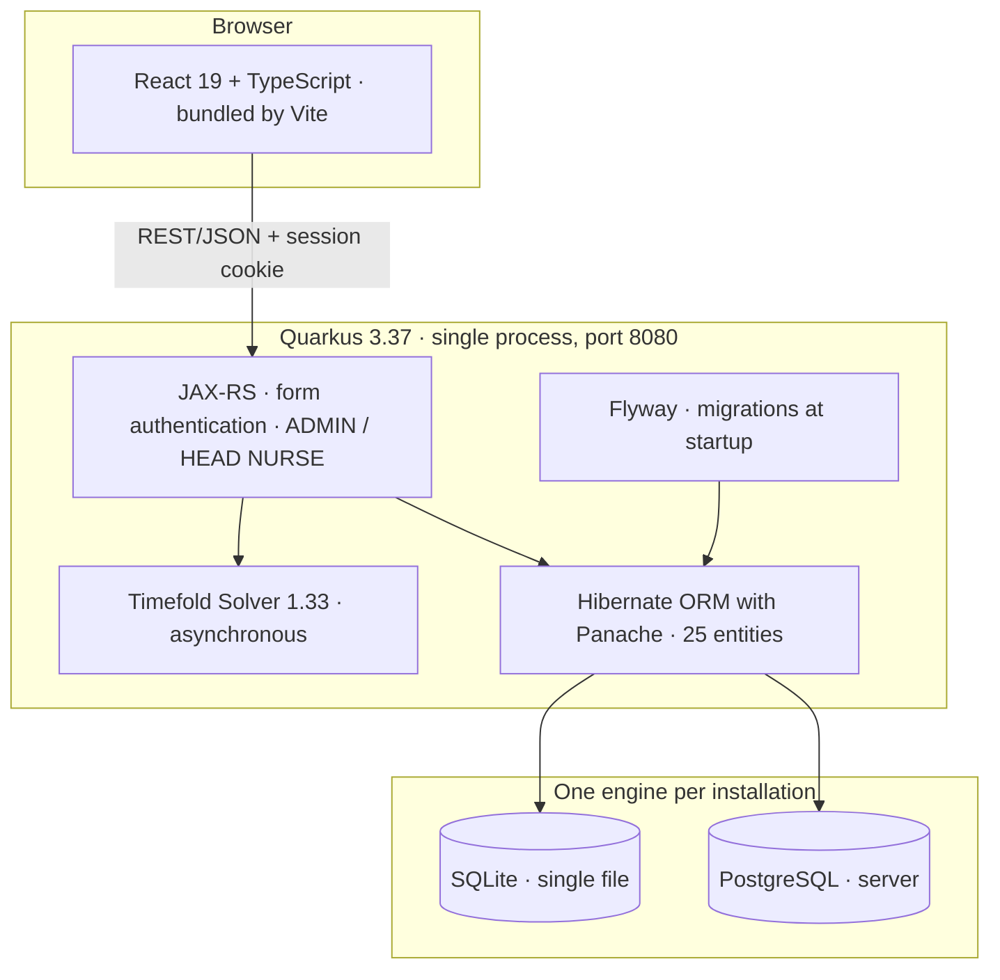

<div align="center">

# Employee Scheduling

**Automated staff shift planning with AI-driven optimisation**


**Backend** Quarkus · **Frontend** React + TypeScript (Vite) · **Solver** Timefold

<sub>Compiled for Java 17, so it runs on the JRE shipped with Debian and Raspberry Pi OS.
Development uses JDK 21.</sub>

</div>

---

## Overview

A production-ready shift management system for healthcare organisations: an interactive
timeline, an AI solver that assigns shifts automatically, multilingual master data, PDF
reporting, e-mail delivery, and backup/restore hardened against partial failure.

The application began as the
[`employee-scheduling` quickstart](https://github.com/TimefoldAI/timefold-quickstarts?tab=readme-ov-file#-employee-scheduling)
from **Timefold Quickstarts** and has since been substantially extended — see
[Relationship to the Timefold quickstart](#relationship-to-the-timefold-quickstart).

| Capability | Details |
|---|---|
| **AI optimisation** | Timefold Solver with hard constraints (skills, availability, minimum rest) and soft constraints (preferences, workload balance) |
| **Dual database** | SQLite for single-machine use, PostgreSQL for multi-user servers, with separate Flyway migrations per engine |
| **Multi-organisation** | Each organisation owns its locations, employees, specialists and **skills**; catalogues never mix and each can be renamed independently |
| **Authentication** | Form-based auth, ADMIN and HEAD NURSE roles, optional e-mail registration with one-time passcode |
| **User approval** | The first account becomes ADMIN; subsequent accounts wait for an administrator's approval |
| **Resilient backup** | Scheduled and manual backups, restore with schema validation and automatic rollback, on both engines |
| **Five languages** | Italian, English, French, Spanish and German, from a single portable catalogue |
| **Cross-platform** | Windows 11 installer (MSI) and Linux service, each with a dedicated setup wizard |

---

## Quick start

```bash
# 1. Clone and build the front end
git clone https://github.com/MirkoUgoliniDev/employee-scheduling.git
cd employee-scheduling/frontend && npm install && npm run build && cd ..

# 2. Start the backend (SQLite, single machine)
#    Pass the profile explicitly: it is a BUILD-TIME choice that fixes the
#    Flyway locations, and a project-local .env can otherwise supply it
#    silently, so the same command produces a different jar on another machine.
mvn quarkus:dev -Dquarkus.profile=sqlite

# 3. Open the application
#    → http://localhost:8080
```

> On first launch no account exists, and the application takes you straight to administrator
> creation: a username and a password are enough. In this mode **no e-mail server and no
> one-time passcode are involved** — those apply only to the `postgresql` profile. See
> [`docs/AUTHENTICATION.md`](docs/AUTHENTICATION.md).

---

## What it looks like


<p align="center"><em>Shift management seen by location: service coverage over the planning window, with the template and solve actions.</em></p>


<p align="center"><em>Solver parameters, per organisation: processing limits, daily and weekly rules, and the weights that tune preferences against balance.</em></p>

> **The walkthrough** — twenty-two screenshots from sign-in to publishing a roster — is in
> [`docs/USER-GUIDE.md`](docs/USER-GUIDE.md). Backup and e-mail templates are covered in
> [`docs/CONFIGURATION.md`](docs/CONFIGURATION.md) instead.

---

## Installation

| Platform | What you run | Guide |
|---|---|---|
| **Windows 11** | [`scripts/install-windows.ps1`](scripts/install-windows.ps1) — builds and packages a native application with a bundled JRE (`jpackage` → `.msi`) | [`docs/INSTALLATION-WINDOWS.md`](docs/INSTALLATION-WINDOWS.md) |
| **Linux** | [`scripts/install-linux.sh`](scripts/install-linux.sh) — one command, installs Java, the database and the systemd service | [`docs/INSTALLATION-LINUX.md`](docs/INSTALLATION-LINUX.md) |
| **Raspberry Pi, headless** | [`scripts/start-web-setup.sh`](scripts/start-web-setup.sh) — start it over SSH, finish it in a browser | [`setup/INSTALL.md`](setup/INSTALL.md) |

```bash
# Raspberry Pi: the whole installation, from an SSH session
curl -fLO https://github.com/MirkoUgoliniDev/employee-scheduling/releases/latest/download/employee-scheduling-raspberry-installer.tar.gz
mkdir employee-scheduling-installer
tar -xzf employee-scheduling-raspberry-installer.tar.gz -C employee-scheduling-installer
cd employee-scheduling-installer
sudo ./scripts/start-web-setup.sh
```

The command prints a local URL and a temporary access code: open it from a browser on the same
trusted network, test SMTP delivery, choose whether to load the sample data, and watch the eight
steps advance. The privileged setup server shuts itself down when the installation finishes.

Whoever installs the application needs neither the repository nor any development tool: the
installers download the package built for the chosen engine. On Windows, **one MSI serves every
deployment** — port, SMTP and registration mode live in a `config.properties` created on first
launch, which takes precedence over what was baked in at packaging time, so no rebuild is ever
needed to change a setting.

---

## Authentication and registration

Two roles, **ADMIN** and **HEAD NURSE**, and a registration flow that follows the deployment:
a single-machine SQLite installation asks for a username and a password, a PostgreSQL server
verifies the e-mail address with a one-time passcode. The first account ever created becomes
the active administrator; every later one waits for approval.

> Roles table, both flows drawn, passcode lifetime and rate limits:
> [`docs/AUTHENTICATION.md`](docs/AUTHENTICATION.md).

---

## Architecture

One process, one port, one artifact: Vite writes the interface into the resources Quarkus
serves, so a single jar carries both. The deployment target is a Raspberry Pi in a clinic,
and every additional moving part is one more thing that can be found broken on a Monday
morning by somebody who is not an administrator.



**The shift is the planning entity and the assigned employee is the only planning variable**:
times and locations are given, people are what the solver decides. A shift can be allowed to
stay unassigned, so that an understaffed week comes back with the gaps visible and penalised
instead of "no feasible solution" — a per-organisation setting, off by default.

> **Why it is built this way** — the two database engines, the per-engine Flyway sets, the
> planning model, the configuration precedence and the trade-offs that were declined:
> [`docs/ARCHITECTURE.md`](docs/ARCHITECTURE.md).

### Front end — `frontend/`

| Directory | Responsibility |
|---|---|
| `src/pages/` | Pages: Home, Shifts, Employees, Locations, Specialists, Structures, Skills, Labels, Dates, Report, Config, Users, Login, Register |
| `src/components/` | Reusable components: modals, navbar, timeline, backup, solver |
| `src/api/` | HTTP client for the REST API |
| `src/auth/` | `AuthContext` — session state, roles, sign-in and sign-out |
| `src/store/` | Global state (Zustand) — currently selected organisation |
| `src/i18n/` | i18next across five languages, plus backend error mapping |

### Backend — `src/main/java/`

| Package | Responsibility |
|---|---|
| `domain/` | Solver entities (`Shift` carries the planning variable) |
| `dto/` | REST data transfer objects |
| `rest/` | REST endpoints, backup and restore, authentication, registration, user management |
| `persistence/` | Panache entities |
| `solver/` | Timefold constraints, hard and soft |
| `config/` | Application entry point, data directory resolution, single-instance guard, Jackson |
| `security/` | HTML sanitisation |
| `utils/` | Lenient JSON deserialisation of numeric fields |

---

## Backup and restore

Scheduled and manual backups on both engines — `VACUUM INTO` on SQLite, `pg_dump -Fc` on
PostgreSQL — and a restore that validates the schema, takes a pre-restore snapshot, and either
applies completely or leaves the database untouched.

> Safeguards, typed outcomes and retention: [`docs/CONFIGURATION.md`](docs/CONFIGURATION.md).

---

## Database

Two engines, one application: **SQLite** for a single machine, **PostgreSQL** for a team, with
separate Flyway migration sets and the engine fixed when the jar is built.

> Environment variables, where the data is written, and the rule about never editing an
> applied migration: [`docs/CONFIGURATION.md`](docs/CONFIGURATION.md).

---

## Development

```bash
cd frontend && npm install && npm run build && cd ..
mvn quarkus:dev -Dquarkus.profile=sqlite     # → http://localhost:8080
cd frontend && npm run dev                   # → http://localhost:5173, proxying :8080
```

> Production build, tests on both engines, and the house rules that will bite you otherwise
> (localisation, immutable migrations, engine parity): [`docs/DEVELOPMENT.md`](docs/DEVELOPMENT.md).

---

## Security

- `deny-unannotated-endpoints=true` — any endpoint without `@RolesAllowed` is denied by default
- Passwords hashed with **bcrypt** through Quarkus form authentication, never compared by hand
- A **single** sign-in error message, so accounts cannot be enumerated
- **One-time passcodes** hashed with SHA-256, compared in constant time, valid five minutes,
  five attempts maximum
- **Rate limiting** on registration: 5 sends per address and 10 per IP address per window
- **E-mail verification** before an account is created
- XSS sanitisation in PDF and e-mail templates
- An administrative token guards every `/backup/*` endpoint
- PostgreSQL passwords never appear in a process command line — only in `PGPASSWORD`
- Partial backups are removed on any failure
- Multi-request operations are **atomic** across the transactional batch endpoints
- Cross-organisation races are guarded by an ownership check on every save of solver results

---

## Relationship to the Timefold quickstart

This project started from the
[`employee-scheduling` quickstart](https://github.com/TimefoldAI/timefold-quickstarts?tab=readme-ov-file#-employee-scheduling)
in **Timefold Quickstarts**, which demonstrates assigning shifts to employees while respecting
availability and skill requirements. The solver domain model and the constraint approach still
follow that example.

Everything around it has been built since: a React front end, a persistence layer supporting
both SQLite and PostgreSQL, authentication and user approval, multi-organisation data isolation,
backup and restore with rollback, PDF and e-mail reporting, five-language localisation, and
installers for Windows and Linux.

Timefold Solver is used in its **Community Edition**, which is Apache-2.0 licensed and carries
no commercial restriction. The Enterprise Edition — not used here — requires a paid licence.

---

## Documentation

The README is the shop window; each document below answers one question, for one reader.

| Document | Answers |
|---|---|
| [`docs/USER-GUIDE.md`](docs/USER-GUIDE.md) | *How do I use it?* — the main workflow, twenty-two screenshots from sign-in to a published roster |
| [`docs/ARCHITECTURE.md`](docs/ARCHITECTURE.md) | *Why is it built this way?* — the single artifact, two database engines, per-engine Flyway sets, the Timefold planning model, declined trade-offs |
| [`docs/INSTALLATION-WINDOWS.md`](docs/INSTALLATION-WINDOWS.md) | *How do I install it on Windows?* — MSI, jpackage, manual build |
| [`docs/INSTALLATION-LINUX.md`](docs/INSTALLATION-LINUX.md) | *How do I install it on Linux?* — the one-line script, the systemd unit by hand, backups, uninstalling |
| [`setup/INSTALL.md`](setup/INSTALL.md) | *How do I install it on a headless Raspberry Pi?* — the browser wizard, step by step |
| [`docs/CONFIGURATION.md`](docs/CONFIGURATION.md) | *What can I change, and where does my data go?* — environment variables, data locations, backups |
| [`docs/AUTHENTICATION.md`](docs/AUTHENTICATION.md) | *Who can do what, and how are accounts created?* — roles, both registration flows, passcodes |
| [`docs/DEVELOPMENT.md`](docs/DEVELOPMENT.md) | *How do I work on it?* — dev mode, build, tests, the house rules |
| [`docs/PACKAGING-WINDOWS-MSI.md`](docs/PACKAGING-WINDOWS-MSI.md) | *How do I ship a release?* — packaging, configuration precedence, field-tested pitfalls |

---

## Licence and attribution

Distributed under the **Apache License 2.0** — full text in [LICENSE](LICENSE).

This project **derives from the `employee-scheduling` quickstart** of
[Timefold Quickstarts](https://github.com/TimefoldAI/timefold-quickstarts), also Apache-2.0, and
has been substantially modified and extended. [NOTICE](NOTICE) records the origin, the changes
and the licences of every third-party component redistributed with the application.

Two obligations apply to anyone redistributing this software:

- **LICENSE and NOTICE travel with the package.** Apache-2.0 requires that the licence and the
  copyright notices are preserved in every copy.
- **The Font Awesome Free icons are CC BY 4.0**, which *requires attribution*. NOTICE already
  satisfies this, provided it is distributed alongside the application.

---

<div align="center">

*Shift management for healthcare teams — [Windows](docs/INSTALLATION-WINDOWS.md) · [Linux](docs/INSTALLATION-LINUX.md) · [Raspberry Pi](setup/INSTALL.md)*

</div>
