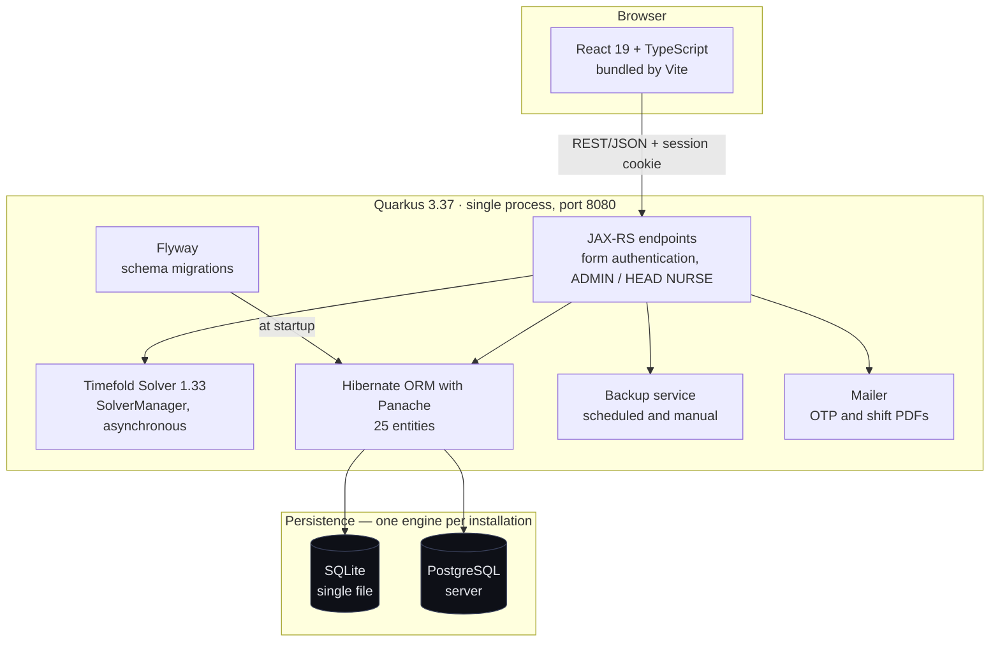
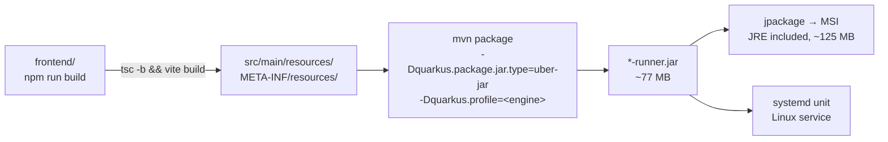
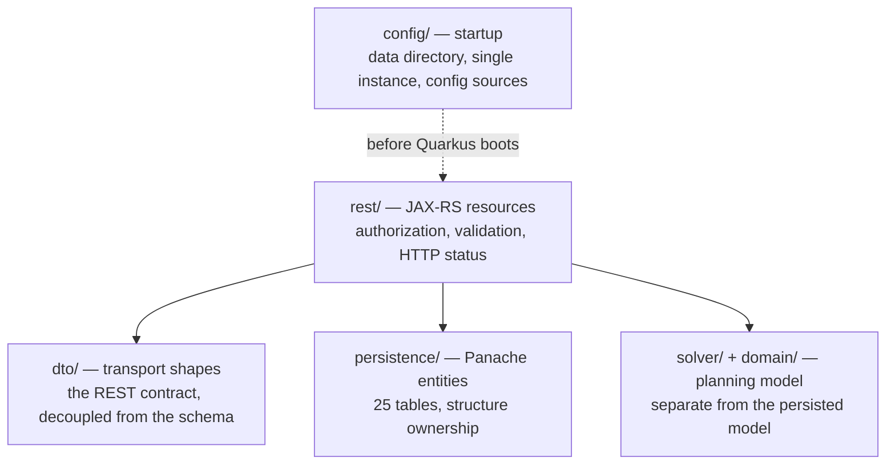
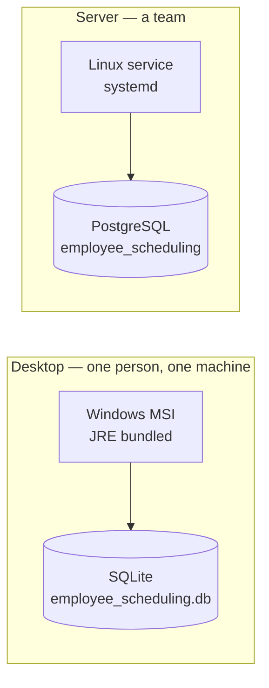
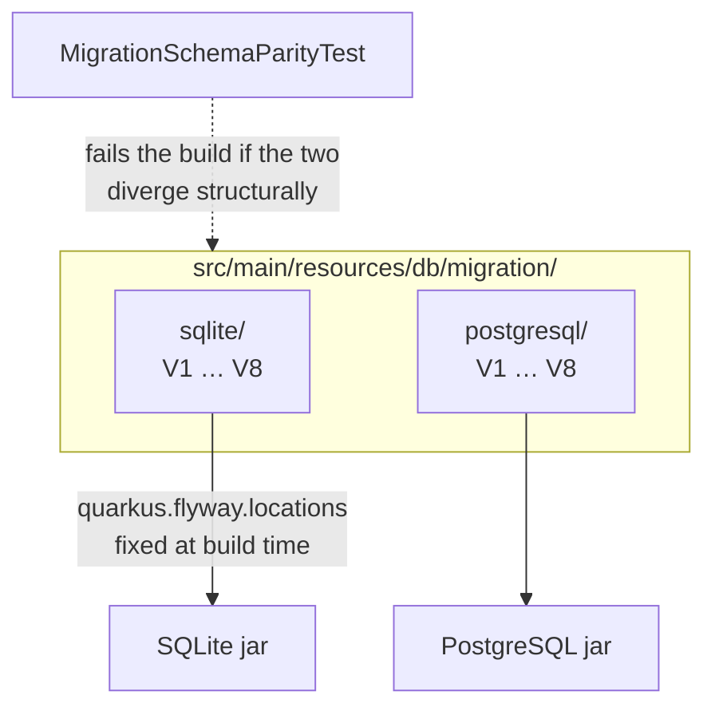
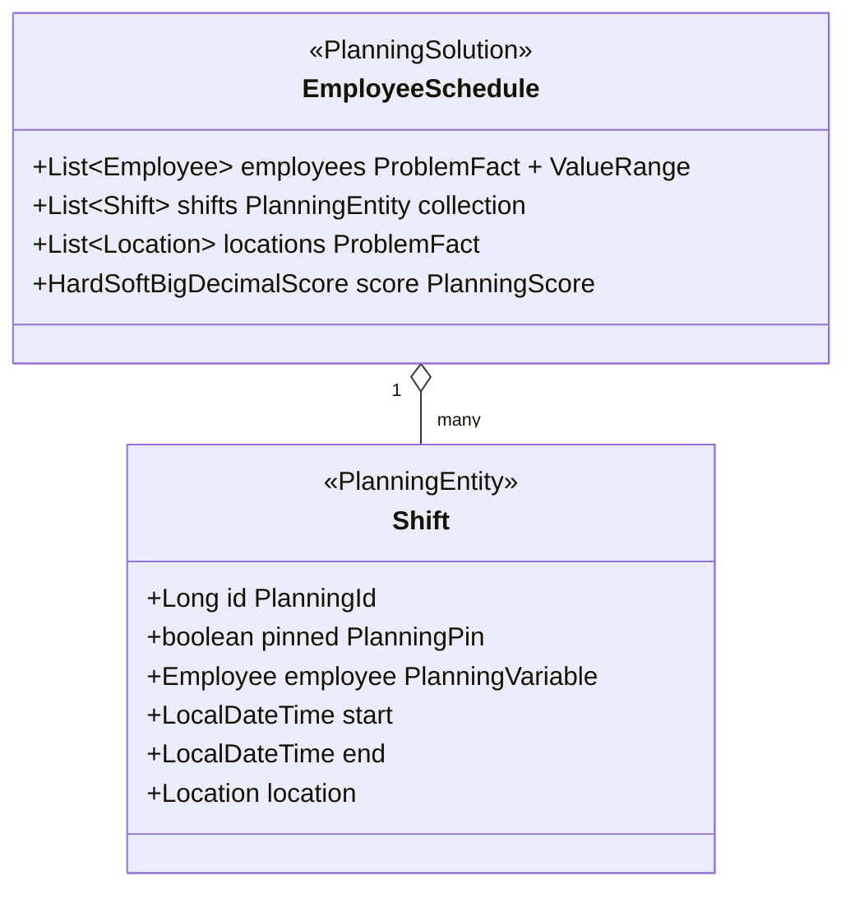
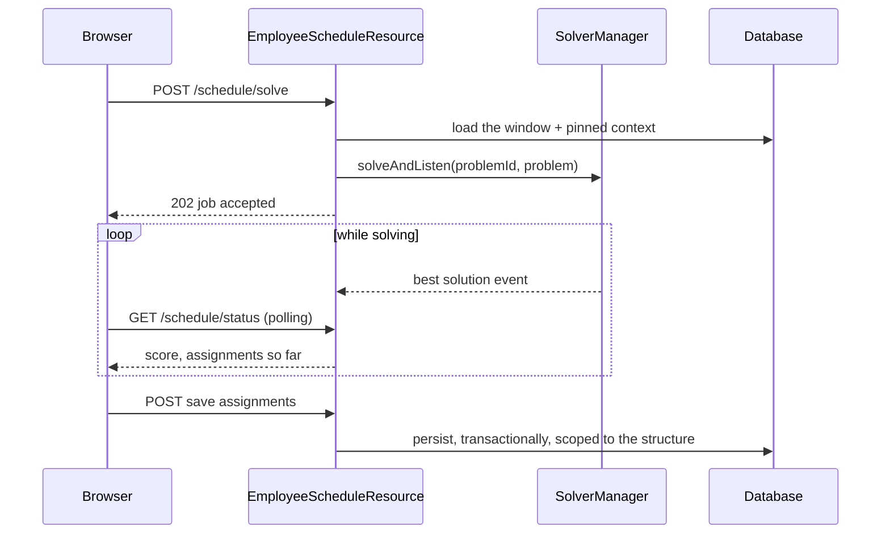
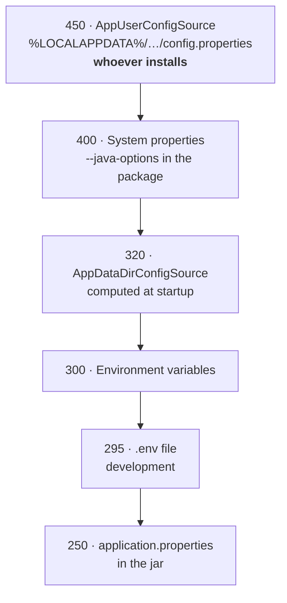

# Architecture

Why this application is built the way it is. Each section states a decision, what it buys,
and what it costs — the constraints are as informative as the choices, and several of them
were paid for in production before they were written down.

The shape of the problem, in one sentence: a small healthcare organisation has to cover
locations with qualified staff, week after week, and the assignment is a constraint
satisfaction problem that a human solves badly and slowly. Everything else — the interface,
the two database engines, the installers — exists to put that solver in the hands of someone
who does not run a server room.

---

## 1. The system at a glance

One process, one port, one artifact. There is no separate frontend server, no message broker
and no cache tier, because the deployment target is a Raspberry Pi in a clinic and every
additional moving part is one more thing that can be found broken on a Monday morning by
somebody who is not an administrator.

---

## 2. One artifact, built in one order

The frontend is not deployed separately: Vite writes its output straight into the resources
that Quarkus serves, so the jar contains the interface.

**The order is load-bearing.** The jar embeds that directory exactly as it is on disk, so a
jar built before the frontend build ships the *previous* interface — and the defect you think
you fixed is still there, in a package that looks correct.

**The profile is build-time.** `quarkus.datasource.db-kind` and `quarkus.flyway.locations`
are fixed when the jar is built; no environment variable changes them afterwards. Building
without a profile is the worst case because it is silent: the default profile has
`quarkus.flyway.active=false`, so migrations never run, no tables are created, and the
application misbehaves without a single error pointing at the cause. Both installers read the
engine baked into the jar and refuse a mismatch before touching the machine.

---

## 3. Front end — React 19, TypeScript, Vite

React for the interactive timeline, which is the heart of the product: dragging a shift onto
an operator and seeing constraints react is not something a server-rendered page does well.
TypeScript because the REST contract has thirty-odd shapes and a rename without a compiler is
a guessing game. Vite (8, on Rolldown) for a dev server that reloads in under a second on a
laptop and produces a code-split bundle without configuration archaeology.

| Directory | Responsibility |
|---|---|
| `src/pages/` | One file per screen: Shifts, Employees, Locations, Specialists, Structures, Skills, Labels, Dates, Report, Config, Users, Login, Register, Home |
| `src/components/` | Modals, navbar, timeline, backup and solver panels |
| `src/api/` | The single HTTP client; every call goes through it, including error-code mapping |
| `src/auth/` | `AuthContext`: session, roles, sign-in and sign-out |
| `src/store/` | Zustand — the selected organisation, and little else |
| `src/i18n/` | i18next in five languages, catalogue fetched from the backend |

In development the Vite server on :5173 proxies to Quarkus on :8080, so there is one origin
and the session cookie behaves exactly as it will in production. In production Quarkus serves
the built assets itself and the SPA fallback filter routes unknown paths to `index.html`.

**Translations live in the database, not in the bundle.** They are edited from the Labels
page at runtime, in five languages, without a rebuild — the reason the i18n catalogue is
fetched rather than compiled in.

---

## 4. Back end — layering

Four packages, one rule: the REST layer never returns an entity. DTOs exist so that a column
rename does not become a breaking API change, and so that a lazily-loaded association cannot
serialise half the database by accident.

The solver model in `domain/` is **deliberately not** the persistence model. Timefold needs a
graph it can copy cheaply thousands of times per second; JPA entities carry proxies, dirty
tracking and a session. Keeping them apart costs a mapping step and buys a solver that never
touches the database mid-solve.

---

## 5. Persistence — Hibernate ORM with Panache

The data layer was hand-written JDBC until July 2026: roughly 6,500 lines of
`PreparedStatement`, string-built SQL and manual result mapping. It was migrated to
Hibernate ORM with Panache one entity at a time, keeping the REST contract identical
bit-for-bit at every step.

What the change bought, concretely:

- **One dialect boundary instead of hundreds.** SQLite and PostgreSQL disagree on
  auto-increment, boolean literals, upserts and date handling. In JDBC every one of those
  disagreements was a place to get wrong; in Hibernate it is a dialect.
- **Transactions that actually span an operation.** Multi-request operations — saving a week
  of assignments, applying a template — are atomic. Before, a failure halfway left rows
  behind.
- **Ownership enforced in one place.** Every entity that belongs to an organisation is
  filtered by structure in the repository, not in each endpoint. Cross-organisation reads
  were a real class of bug before.

The remaining direct JDBC is deliberate and narrow: compatibility DDL for pre-Flyway
databases, and the SQLite backup path, which needs `VACUUM INTO` on a real connection.

---

## 6. Two engines, one application

| | SQLite | PostgreSQL |
|---|---|---|
| Deployment | A file next to the user's data | A service to install and maintain |
| Concurrency | One writer at a time | Real concurrent access |
| Backup | `VACUUM INTO`, consistent and hot | `pg_dump -Fc`, `pg_restore --single-transaction` |
| Registration | Standalone: username and password | Server: email with a one-time passcode |
| Intended for | A clinic where one person plans | Several people planning together |

Supporting both is not free — it is the reason for two migration directories, a parity test
and a build-time profile. It is worth it because the alternative was asking a single-user
clinic to install and maintain a database server, which is exactly the barrier that stops
this kind of software from being used at all.

**The file and the database now share a name.** The SQLite file is
`employee_scheduling.db`, matching the PostgreSQL database and role. It used to be
`large_data.db`, inherited from the Timefold quickstart. Renaming it required a migration
that runs *before* Quarkus boots (`LegacyDatabaseName`, called from `AppMain.main()`),
because Flyway would otherwise create an empty database under the new name while the real one
sat beside it — an empty application with the data two centimetres away and no error anywhere.

---

## 7. Flyway — one migration set per engine

The two directories hold the same eight versions with the same logical schema, written in
each engine's dialect. They are not shared, because a single set would mean either a
lowest-common-denominator schema or runtime branching inside the SQL. They cannot silently
drift, because `MigrationSchemaParityTest` compares tables, columns, constraints and indexes
and fails the build — and it rejects structural DDL it does not understand rather than
reporting a false pass.

Two settings deserve their reasoning:

- **`baseline-on-migrate=false`.** Pointing the application at a populated database with no
  `flyway_schema_history` fails loudly. With baselining on, that same database would be
  silently stamped at version 1 and later migrations would run against a schema that never
  received the earlier ones — corruption discovered weeks later.
- **`migrate-at-start=true`.** Upgrading is "install the new package and start it". There is
  no migration step for the administrator to forget, because there is no administrator.

---

## 8. Timefold Solver — the planning model

The shift is the planning entity and the assigned employee is the only planning variable:
times and locations are given, people are what the solver decides. Three details matter.

**`allowsUnassigned = true`.** A shift may stay empty. Without it, an understaffed week has no
feasible solution at all and the solver returns nothing useful; with it, the schedule comes
back with the gaps visible and a penalty attached, which is the answer a planner can act on.

**`@PlanningPin`.** Shifts already decided — and shifts just outside the planning window —
are pinned. This is what fixed the "blindness at the window edges": solving a week in
isolation produced a schedule that was locally perfect and violated the rest rule against the
Sunday before it.

**`HardSoftBigDecimalScore`.** Hard constraints are inviolable, soft ones are preferences, and
the decimal part exists because soft penalties are measured in minutes and weights are
user-configurable — integer arithmetic accumulated rounding error across thousands of shifts.

### The constraints

Eight hard constraints, thirteen soft ones, exactly as named in
`EmployeeSchedulingConstraintProvider`:

| Hard — never violated | Soft — traded off |
|---|---|
| Missing required skill | Optional skill match |
| Unavailable employee | Desired day for employee |
| Overlapping shift | Undesired day for employee |
| At least 10 hours between 2 shifts | Maximum consecutive days |
| Max one shift per day | Minimum days off per week |
| Maximum weekly hours | Weekly shift range · Minimum weekly shifts (empty week) |
| Incompatible specialist | Avoid specialist |
| Unassigned shift forbidden | Unassigned shift penalty |
| | Balance employee hours · Balance employee shift assignments · Balance night shifts |
| | Same location continuity |

Note where the line falls: a maximum of *weekly hours* is hard, a maximum of *consecutive
days* is soft. The first is a legal limit, the second a preference that a short-staffed week
may have to break — and a hard constraint there would return "no feasible solution" precisely
when the planner most needs an answer.

Every soft weight is editable per organisation from the Solver Parameters page. The unit is
deliberate: counted violations are multiplied by a weight and by `SOFT_UNIT_MINUTES` (480, a
working day) so that they are commensurable with the penalties naturally expressed in minutes.
Before that, three soft constraints were inert — present in the code, worth nothing in the
score.

### Solving is asynchronous

`SolverManager` runs the solve on its own thread with a termination limit (30 seconds by
default, configurable per organisation). The HTTP request never blocks; the interface shows
the best solution found so far and the user decides when to keep it. Nothing is written until
they do.

---

## 9. Configuration — who wins over whom

Higher ordinal wins. The unusual choice is the top one: **the user's file sits above the
values baked into the package**, on purpose. Those baked values are defaults, and whoever
installs the application must be able to fix a port already taken by another program without
depending on whoever produced the installer.

One exception: `app.data.dir` is ignored from that file, because by the time it is read the
data directory has already been resolved. Honouring it would produce a configuration that
says one thing and an application that does another.

---

## 10. Data, backups, and where things live

Application data lives **outside** the installation directory —
`%LOCALAPPDATA%\EmployeeScheduling` on Windows, the configured data directory on Linux. This
is not tidiness: it is the fix for three real failures. Uninstalling used to delete the
user's database; the uninstaller could not remove a log file the running application held
open; and hardening the backup directory's permissions locked out SYSTEM, which is the
account the MSI uninstaller runs as.

Backups are scheduled and also taken before every destructive operation. Restore is not a
file copy: the backup is staged, validated, its schema compared against the live one, and a
pre-restore snapshot is taken — then the restore either applies completely or leaves the
database untouched, and reports which of those happened as a typed outcome.

---

## 11. What was deliberately not done

- **No microservices.** One process is easier to install, back up and reason about, and the
  load is a handful of concurrent planners.
- **No container by default.** The target user installs an MSI or runs one shell script;
  asking them for Docker would lose them.
- **No Timefold 2.x.** The score analysis it adds is an Enterprise feature; the Community
  Edition on 1.33 covers what this application needs.
- **No in-place MSI upgrade.** Uninstall and reinstall, with the data untouched because it
  lives elsewhere. Simple, and honest about it.

---

## Related documents

| Document | Contents |
|---|---|
| [`INSTALLATION-WINDOWS.md`](INSTALLATION-WINDOWS.md) | Installing on Windows, and the manual build |
| [`INSTALLATION-LINUX.md`](INSTALLATION-LINUX.md) | Installing on Linux, from the script or by hand |
| [`PACKAGING-WINDOWS-MSI.md`](PACKAGING-WINDOWS-MSI.md) | Windows packaging, configuration precedence, pitfalls |
| [`../setup/INSTALL.md`](../setup/INSTALL.md) | Linux server and Raspberry Pi wizard |
