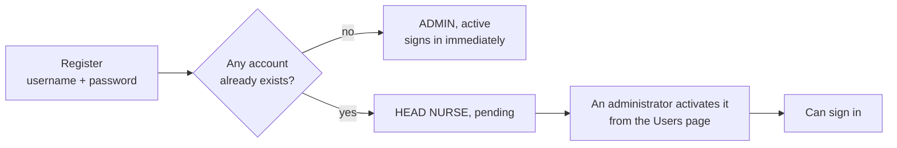
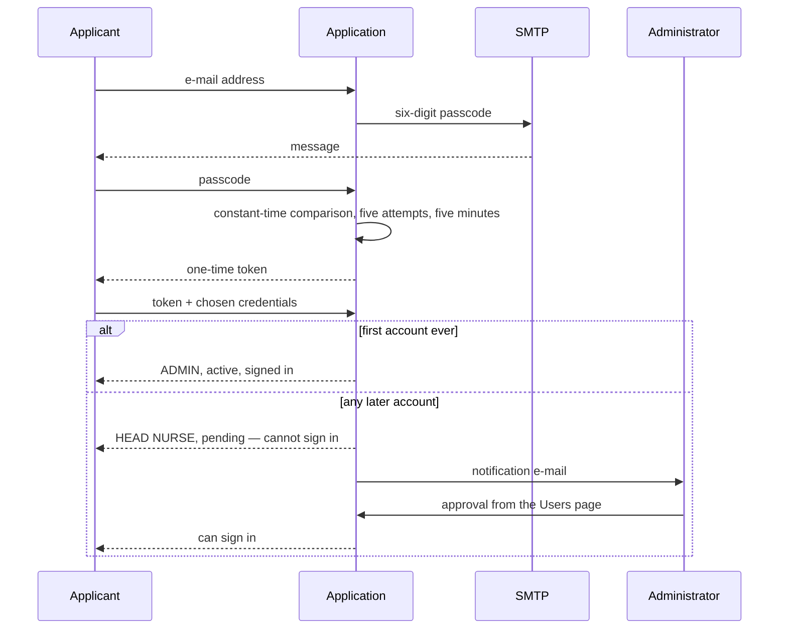

# Authentication, roles and registration

Who can do what, how an account comes into existence, and why the flow differs between a
desktop installation and a server one.

The short version: the deployment decides. A single-machine SQLite installation has no mail
server and asks for a username and a password; a PostgreSQL server verifies an e-mail address
with a one-time passcode. Neither is a setting somebody has to remember to change —
`app.registration.mode` defaults to `auto` and follows the engine.

---

## Roles

| Role | Access |
|---|---|
| **ADMIN** | Configuration, backup and restore, labels, organisations, SMTP, solver parameters, **user management and approval** |
| **HEAD NURSE** | Shifts, employees, locations, specialists, affinities, date preferences, reports, shift e-mails |

> HEAD NURSE is **`CAPOSALA`** in the API, in the annotations and in the `app_users.role`
> column, for historical reasons. Send that value, not the English label, or the endpoint
> answers `USER_ROLE_INVALID`.

The **skills** catalogue is administered from Configuration, which the interface opens to
administrators only; head nurses assign skills to employees and locations and are not offered
the catalogue itself. This is enforced, not merely hidden: `POST /demo-data/save_skills` and
`DELETE /demo-data/skills/{id}` are `@RolesAllowed("ADMIN")`, matching `LocalizzazioneResource`,
which renames the same skills in five languages.

## Registration flow

The mode follows the deployment type (`app.registration.mode`):

**Standalone — SQLite, no mail server**

```
First launch (no accounts yet)          Subsequent registrations
┌──────────────────────────────┐       ┌──────────────────────────────┐
│  username + password         │       │  username + password         │
│        ▼                     │       │        ▼                     │
│  Becomes ADMIN (active)      │       │  Becomes HEAD NURSE          │
│  signs in immediately        │       │  awaits admin approval       │
└──────────────────────────────┘       └──────────────────────────────┘
```

**Server — PostgreSQL, e-mail verified with a one-time passcode**

```
First launch (no accounts yet)          Subsequent registrations
┌──────────────────────────────┐       ┌──────────────────────────────┐
│  e-mail → OTP → credentials  │       │  e-mail → OTP → credentials  │
│        ▼                     │       │        ▼                     │
│  Becomes ADMIN (active)      │       │  Becomes HEAD NURSE          │
│  signs in immediately        │       │  admins notified by e-mail   │
└──────────────────────────────┘       │  awaits admin approval       │
                                       └──────────────────────────────┘
```

- **Standalone** — no passcode and no mail server required to register
- **Server** — six-digit passcode sent by e-mail, valid for five minutes, compared in constant
  time, five attempts maximum, with rate limiting: 5 sends per address and 10 per IP address
  in a five-minute window, plus 30 completion attempts per IP, which bounds guessing of the
  one-time token
- **Pending accounts** cannot sign in: the application answers `INACTIVE` and explains why
- **E-mail addresses** are stored on `app_users` in a unique column (migration V3)

## Endpoints

| Endpoint | Access | Purpose |
|---|---|---|
| `GET /auth/register/status` | Public | Whether the next account will be the first (ADMIN) |
| `POST /auth/register/otp` | Public | Sends the one-time passcode (rate limited) |
| `POST /auth/register/verify` | Public | Verifies the passcode, issues a single-use token |
| `POST /auth/register/complete` | Public | Creates the account (ADMIN, or HEAD NURSE pending approval) |
| `GET /auth/me` | Public | Current session, with `reason=INACTIVE` when not yet approved |
| `POST /auth/logout` | Authenticated | Invalidates the session |
| `GET/POST/PUT/DELETE /users/**` | ADMIN | User management and approval |

---

## The flows, drawn

**Standalone** — SQLite, no mail server:



**Server** — PostgreSQL, e-mail verified:



Rate limiting applies to sending, not only to guessing: five passcodes per address and ten per
IP address in a window. Without it, the endpoint is a way to have the application send mail to
arbitrary addresses.

---

## Related

| Document | Contents |
|---|---|
| [`ARCHITECTURE.md`](ARCHITECTURE.md) | Where authorization sits in the layering, and structure ownership |
| [`CONFIGURATION.md`](CONFIGURATION.md) | `AUTH_SESSION_KEY`, SMTP variables, `app.registration.mode` |
| [`USER-GUIDE.md`](USER-GUIDE.md) | Approving an account from the interface |
