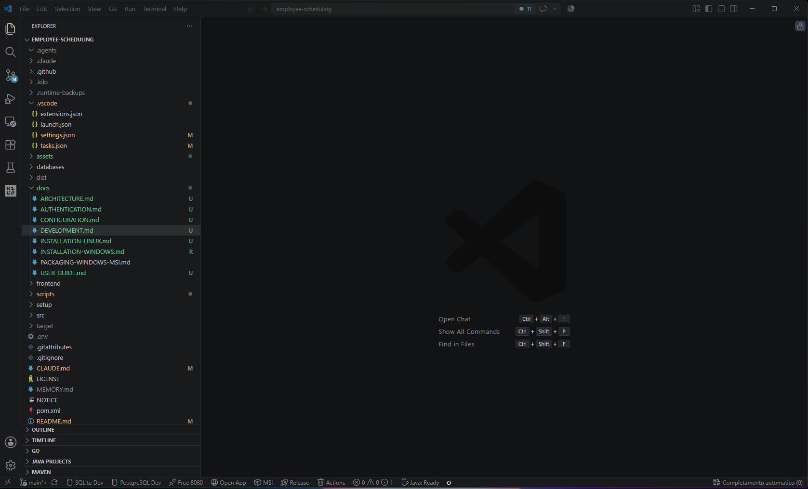

# Development

Running the project from a checkout, building it, and testing it.

**Prerequisites**: JDK 21, Maven 3.9, Node.js 20+. The application is compiled for Java 17 so
it runs on the JRE shipped with Debian and Raspberry Pi OS, but development uses 21.

---

## VS Code: the status-bar buttons

The repository ships a `.vscode/` folder that turns the commands below into one-click buttons in
the status bar, so the usual development loop does not need a terminal at all.



### The extension that draws them

One extension, and one only, is required:

| | |
|---|---|
| **Name in the Marketplace** | Status Bar Commands |
| **Publisher** | anweber |
| **Identifier** | `anweber.statusbar-commands` |
| **Install from the command line** | `code --install-extension anweber.statusbar-commands` |
| **Install from the interface** | **Extensions** (`Ctrl+Shift+X`) → paste `anweber.statusbar-commands` into the search box → **Install** |

Search the Marketplace for the identifier rather than the name: several extensions are called
something like "status bar", and only this one reads the `statusbar_command.commands` array in
`.vscode/settings.json`, which is where the seven buttons are declared — one entry per button.

You do not normally have to look it up. It is listed in `.vscode/extensions.json`, so VS Code
offers it in a notification the first time the project is opened, and **Extensions → Recommended**
lists it alongside the other recommendations (Java pack, Quarkus, XML, ESLint, Prettier, React
snippets, Auto Rename Tag). Installing it is enough — there is nothing to configure, the buttons
appear as soon as the window reloads.

Without the extension nothing breaks: the tasks still exist and **Terminal → Run Task…** lists
them all. You just lose the one-click access.

### What each button does

From left to right. The captions are set in `.vscode/settings.json` and can be changed freely —
what identifies a button is the task name it passes as an argument.

| Button | What it does |
|---|---|
| **SQLite Dev** | Runs `mvn quarkus:dev` on the default SQLite profile — live reload on :8080 |
| **PostgreSQL Dev** | The same dev mode with `-Dquarkus.profile=postgresql`, against the PostgreSQL database |
| **Free 8080** | Kills whatever holds port 8080, for when a previous dev mode did not shut down cleanly |
| **Open App** | Opens `http://localhost:8080` |
| **MSI** | Rebuilds front end and back end and produces the Windows installer (`scripts\install-windows.ps1 -Package msi`) |
| **Release** | Asks for a version number, then publishes the Windows and Raspberry/Linux packages (`scripts\publish-release.ps1`) |
| **Actions** | Deletes old completed GitHub Actions runs, keeping the number you are prompted for |

The two release buttons act on the public repository: they are the packaging workflow described in
[`PACKAGING-WINDOWS-MSI.md`](PACKAGING-WINDOWS-MSI.md), not something to press casually.

Each button runs a task defined in `.vscode/tasks.json`, which also holds a few entries with no
button of their own — `Maven: Build`, `Maven: Test`, `Maven: Clean`, the debug dev mode
(`-Dsuspend`, to attach a debugger before startup) and `App: Kill EmployeeScheduling`, which stops
an installed instance. Run those from **Terminal → Run Task…**, or give them a button by adding an
entry to `statusbar_command.commands`.

---

## Backend

```bash
# SQLite
mvn quarkus:dev

# PostgreSQL
QUARKUS_PROFILE=postgresql mvn quarkus:dev            # bash
$env:QUARKUS_PROFILE="postgresql"; mvn quarkus:dev    # PowerShell

# → http://localhost:8080
```

## Front end with hot reload

```bash
cd frontend && npm run dev
# → http://localhost:5173, proxying :8080
```

## Production build

```bash
cd frontend && npm run build   # emits into src/main/resources/META-INF/resources/
mvn package -DskipTests -Dquarkus.package.jar.type=uber-jar -Dquarkus.profile=sqlite
```

> `-Dquarkus.profile` is **required**. The database engine and the Flyway migration locations
> are fixed at build time and cannot be changed by an environment variable afterwards. Note also
> that Quarkus reads the `.env` file during the build, so a project-local `.env` can silently
> supply the profile — always pass it explicitly.

## Tests

```bash
mvn -B test "-Dquarkus.test.profile=test-sqlite"        # 184 tests, 18 skipped
mvn -B test "-Dquarkus.test.profile=test-postgresql"    # requires PostgreSQL
```

> Do **not** export `BACKUP_ADMIN_TOKEN` for the test run: the test profiles supply their own
> token. If it is already set in your shell it must be at least 32 bytes, otherwise the backup
> filter rejects it and eight tests fail with 503 where they expect 401 or 200.

---

## When something misbehaves in development

| Symptom | Resolution |
|---|---|
| **Port 8080 already in use** | Development: `.\scripts\kill-port.ps1 8080`. Installed application: set `quarkus.http.port=8081` in `%LOCALAPPDATA%\EmployeeScheduling\config.properties` and restart |
| **Blank page, assets returning 401** | A session cookie issued by another instance, with a different encryption key. Delete `employee_scheduling_session` for `localhost:8080`, or use a private window |
| **Interface stuck in one language, selector inert** | The translation cache is full. From the browser console, remove the `i18n_cache*` keys and reload |
| **Startup blocked by Flyway** (`no schema history table`) | The `sqlite` profile only manages databases created by Flyway; for a legacy file use the `legacy-sqlite` profile |
| **Passcode never arrives** | In development the mailer is **mocked**: the code is printed to the console log. Configure SMTP for real delivery |
| **Sign-in refused, account pending** | An administrator must approve the account under **Users** |
| **PostgreSQL tests failing** | A running PostgreSQL with an `employee_scheduling_test` database is required |
| **PostgreSQL backup disabled** | Install the client tools (`pg_dump`, `pg_restore`) or set `backup.postgresql.bin-dir` |

---

## House rules that will bite you otherwise

- **Every UI string goes through `t()`** and needs its five translations in
  `src/main/resources/i18n/ui-translations.tsv`. `UiTranslationCatalogTest` fails the build if
  a language is missing, and translations live in the database so they can be edited at
  runtime without a rebuild.
- **An applied Flyway migration is immutable.** Its checksum is recorded; changing the file —
  comments included — stops every existing installation from starting. Add a new version.
- **The two migration directories move together.** A change to `db/migration/sqlite` needs its
  counterpart in `db/migration/postgresql`; `MigrationSchemaParityTest` fails the build
  otherwise.
- **Code comments are written in English**, user-facing application text in Italian. The full
  rule, with its reasoning, is in `CLAUDE.md`.

---

## Related

| Document | Contents |
|---|---|
| [`ARCHITECTURE.md`](ARCHITECTURE.md) | The layering, the planning model, why there are two engines |
| [`CONFIGURATION.md`](CONFIGURATION.md) | Environment variables and where data is written |
| [`PACKAGING-WINDOWS-MSI.md`](PACKAGING-WINDOWS-MSI.md) | Producing a release package |
