# User guide

A walk through the application in the order the work actually happens: sign in, configure an
organisation, prepare the scheduling data, generate a roster, publish it.

The screenshots use demonstration records — names, addresses and e-mail addresses are examples
only. Labels vary with the selected interface language and with the permissions of the account
you sign in with, so a head nurse sees fewer sections than the administrator shown here.

> New installation? Start from [`INSTALLATION-WINDOWS.md`](INSTALLATION-WINDOWS.md) (Windows),
> [`INSTALLATION-LINUX.md`](INSTALLATION-LINUX.md) (Linux) or
> [`../setup/INSTALL.md`](../setup/INSTALL.md) (Raspberry Pi wizard).

---

## 1. Sign in and select a workspace

Open the application URL and enter your credentials. Use **Register** to request an account:
in server deployments the address is verified with a passcode, and in either mode every account
after the first waits for approval. Newly registered server-mode accounts may require approval
from an administrator before they can access the application.

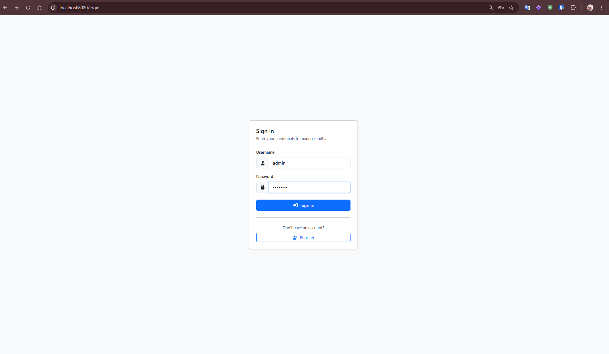

<em>Figure 1 — The sign-in page provides access to authentication and optional account registration.</em>

After authentication, the home page shows the currently selected organisation in the upper-right
corner. Administrators can switch organisations there; all locations, operators, skills,
templates and solver settings are scoped to that selection.

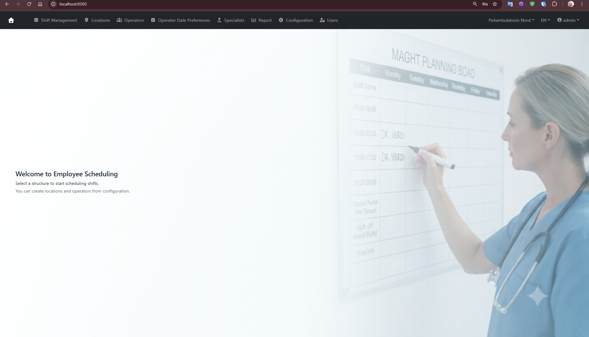

<em>Figure 2 — The home page introduces the active workspace and can display organisation-specific guidance.</em>

## 2. Configure the organisation

Start in **Configuration → Structures**. A structure represents an organisation or independent
scheduling workspace. Use **Add** to create one, the pencil icon to edit it, and the selector in
the navigation bar to make it active.

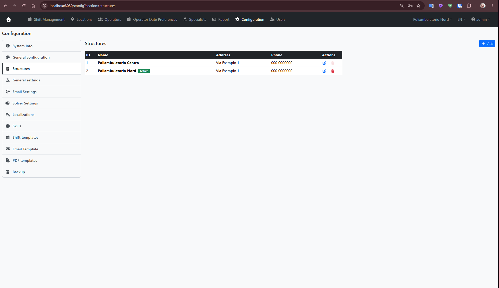

<em>Figure 3 — Structures isolate scheduling data and allow administrators to manage multiple organisations.</em>

In **General settings**, choose whether Shift Management displays a week or a month at a time.
Automatic template population can pre-fill empty current or future periods, while leaving past
periods untouched.

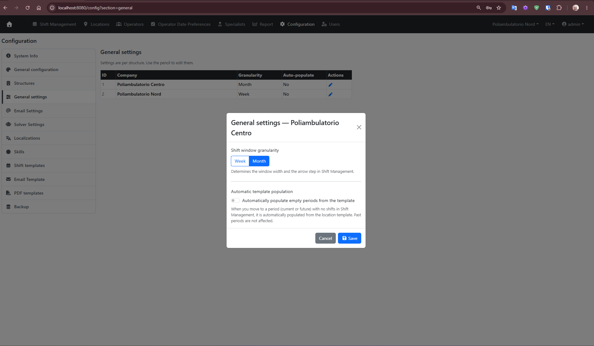

<em>Figure 4 — Structure-level settings control the planning window and optional template pre-population.</em>

Define the qualifications used by the solver under **Configuration → Skills**. Skills belong to
one structure, can be ordered for display, and can be deactivated without deleting historical
references.

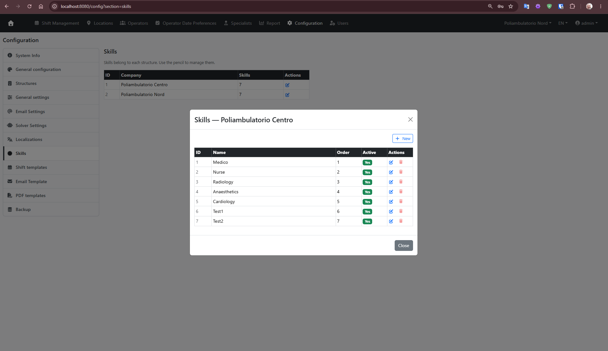

<em>Figure 5 — The skill catalogue supplies the capabilities required by locations and held by operators.</em>

The **Specialists** page maintains the professionals who may supervise or be associated with
locations. Active status controls whether a specialist is available for current planning data.

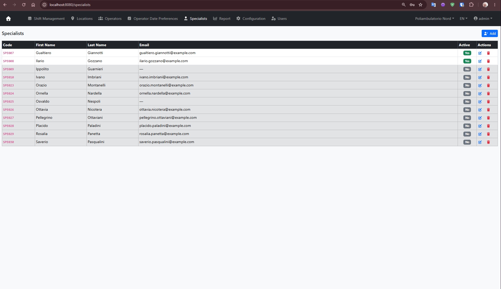

<em>Figure 6 — Specialists are maintained separately from operators and may be linked to locations and compatibility rules.</em>

## 3. Create locations and operators

The **Locations** page lists the service points that require coverage. Codes provide stable
identifiers, ordering controls their presentation, and inactive rows remain visible for
administrative purposes without participating in new schedules.

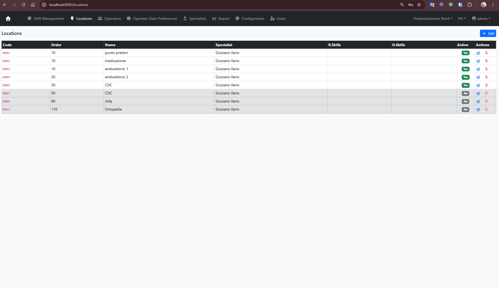

<em>Figure 7 — The location register summarises ownership, ordering, skill requirements and active status.</em>

When editing a location, assign its specialist and mark skills as **Required** or **Optional**.
Required skills are hard eligibility conditions; optional skills can influence assignment quality
without making coverage impossible.

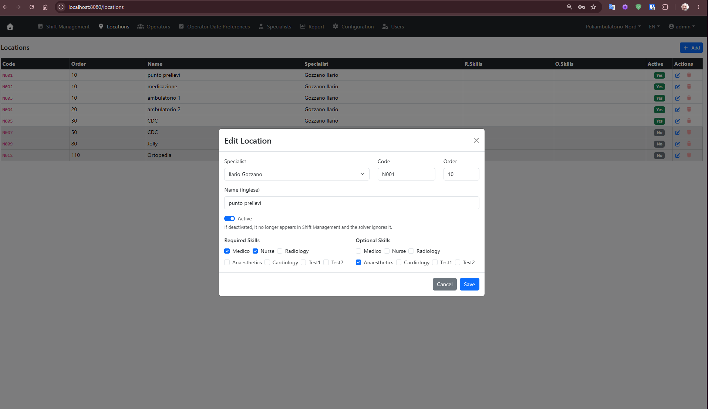

<em>Figure 8 — Location details define the capabilities the solver must consider for each assignment.</em>

Use **Operators** to maintain the employees who can receive shifts. The table provides an overview
of identity, skills, specialist relationships and active status. Deactivated operators are kept
for historical consistency but are excluded from new solver runs.

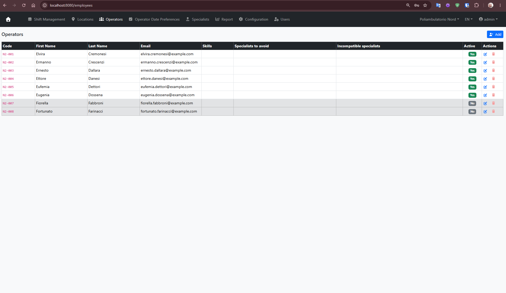

<em>Figure 9 — The operator register is the central roster of assignable employees.</em>

The operator editor combines personal details, qualifications and specialist compatibility.
Choose **Avoid** for a soft preference or **Incompatible** for a hard prohibition. Use the latter
carefully: strict incompatibilities can leave shifts uncovered when no eligible operator remains.

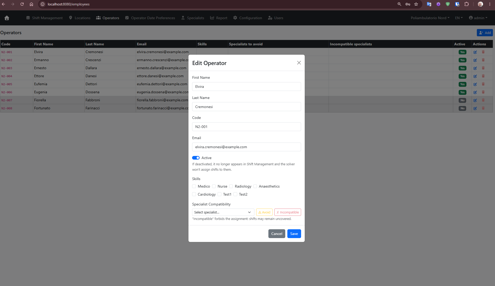

<em>Figure 10 — Operator qualifications and compatibility rules directly affect solver eligibility and scoring.</em>

## 4. Record date preferences and availability

Open **Operator Date Preferences** to record dates that an operator desires, would prefer to
avoid, or cannot work. **Unavailable** is a hard restriction; **Desired** and **Undesired** dates
are optimisation preferences whose importance is configured in Solver Settings.

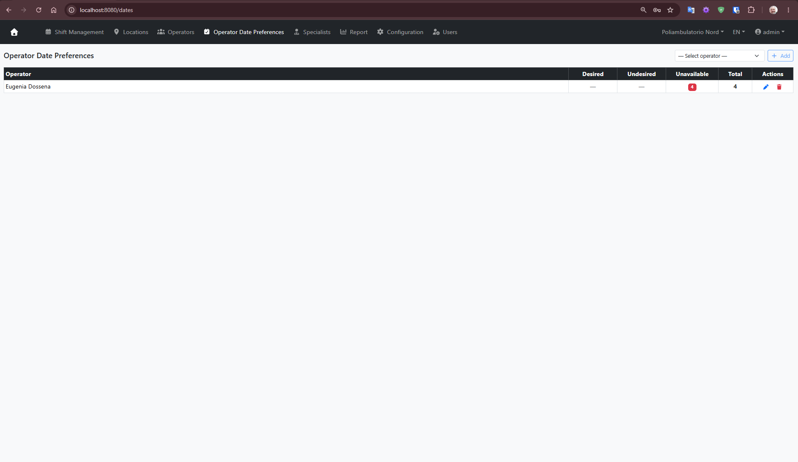

<em>Figure 11 — Date preferences provide the solver with individual availability and preference information.</em>

## 5. Build reusable shift templates

Templates describe a recurring coverage pattern. In **Configuration → Shift templates**, click an
empty timeline area to add a shift and click an existing block to edit it. A template can later be
applied manually from Shift Management or populated automatically according to General settings.

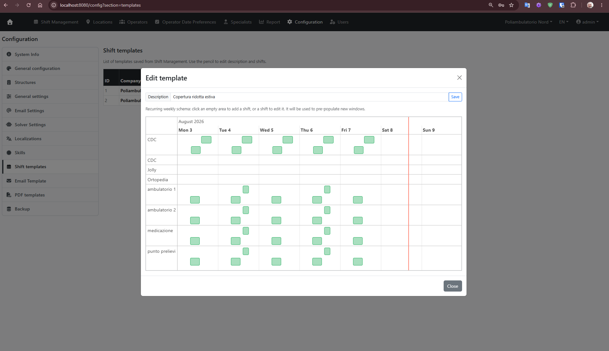

<em>Figure 12 — A reusable weekly template defines the expected shifts for each location.</em>

## 6. Prepare and solve a schedule

**Shift Management** is the main planning workspace. In **By operator** view, each row represents
an operator and each block represents an assigned shift. Use the arrows or **Today** to navigate
between periods. The colour legend distinguishes unassigned, assigned, desired, undesired and
unavailable states.

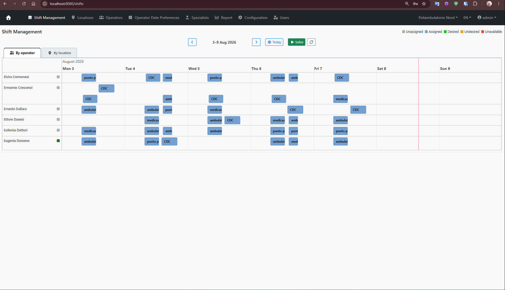

<em>Figure 13 — The operator view makes individual workload and weekly assignments easy to review.</em>

Switch to **By location** to verify coverage. From here an authorised user can fill the period
from a template, save the current pattern as a template, edit individual shifts, and launch the
solver. Review both views before publishing the schedule.

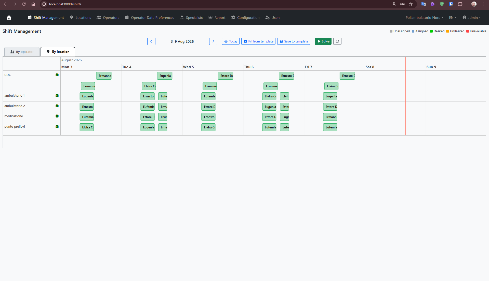

<em>Figure 14 — The location view focuses on service coverage and exposes template and solve actions.</em>

Solver behaviour is configured per structure. Processing limits control runtime and early
stopping; daily and weekly rules define rest and workload boundaries; optimisation weights tune
the relative importance of preferences and balance. A value of `0` disables the limit wherever
the field help explicitly says so.

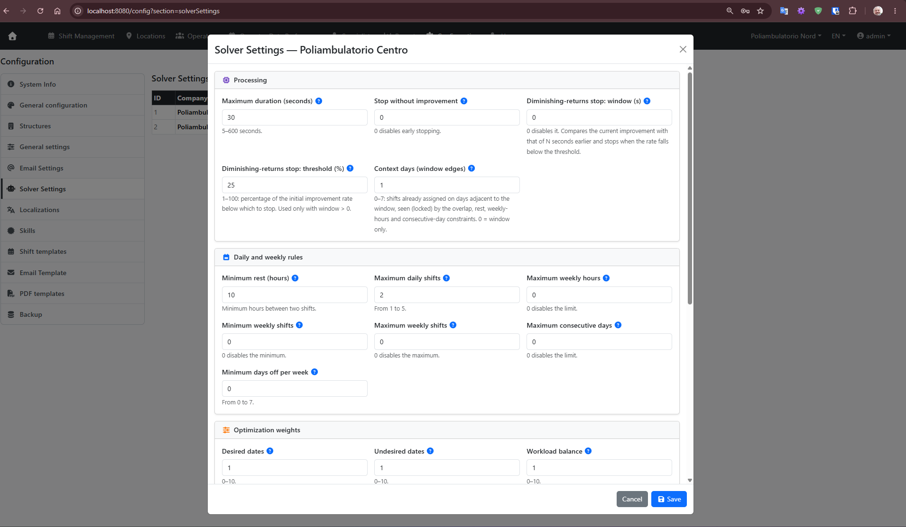

<em>Figure 15 — Solver Settings centralise processing limits, hard scheduling rules and optimisation weights.</em>

## 7. Generate and distribute reports

The **Report** page summarises coverage for the selected period and location. Generate PDFs only
after checking uncovered shifts and total hours. Existing documents can be opened or downloaded
from the results table, while **Send Shifts** supports e-mail distribution when SMTP is configured.

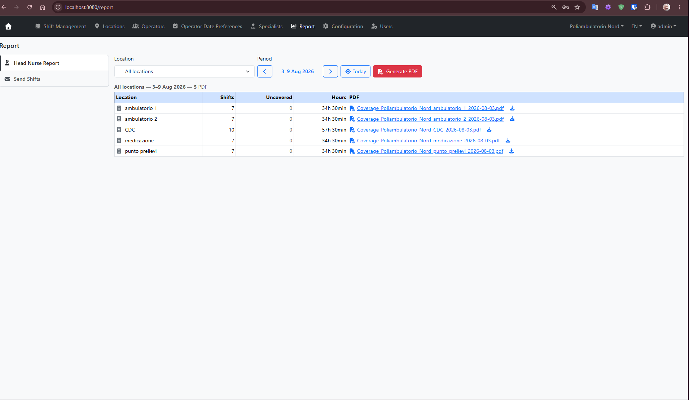

<em>Figure 16 — Coverage reporting highlights shift totals, uncovered work, hours and generated PDF files.</em>

Use **Configuration → PDF templates** to apply organisation branding. Each structure can have its
own logo, header, footer and primary colour; the live preview shows the approximate document
appearance before saving.

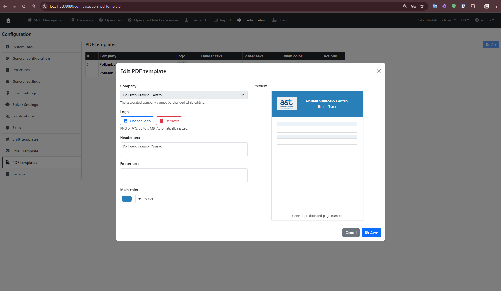

<em>Figure 17 — PDF templates provide consistent organisation-specific branding for exported reports.</em>

## 8. Configure communications and presentation

In **Email Settings**, enter the SMTP host, port, transport security, credentials and sender
identity. Save changes before using **Send test**. Passwords and production server details should
never be included in screenshots, issue reports or repository files.

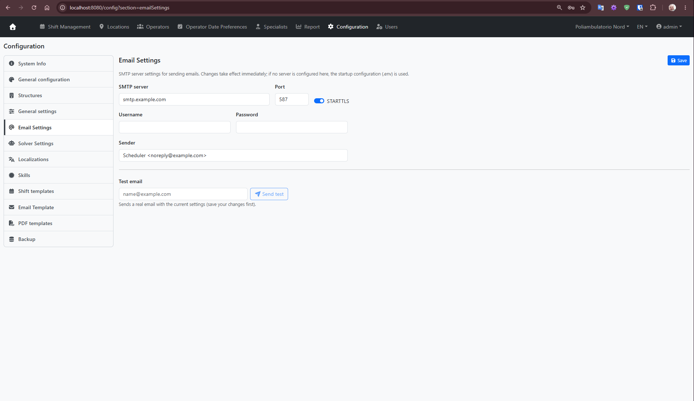

<em>Figure 18 — SMTP configuration enables registration messages, approvals and schedule delivery.</em>

The home page content is editable under **General configuration**. Administrators can select a
cover image and maintain a title, main message and hint for every supported language. Saving one
language does not replace the text stored for the others.

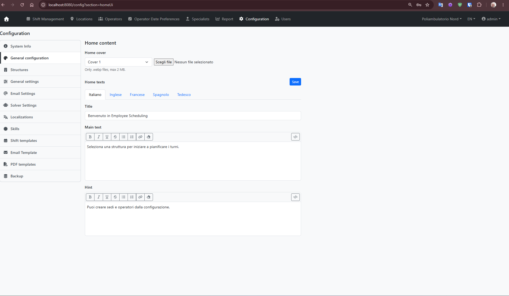

<em>Figure 19 — Multilingual home-page content can be tailored to each deployment.</em>

The **Localizations** catalogue contains the interface keys used throughout the application.
Search by key or description, then edit the translations for each supported language. Keep the
key stable: application code refers to it as a permanent identifier.

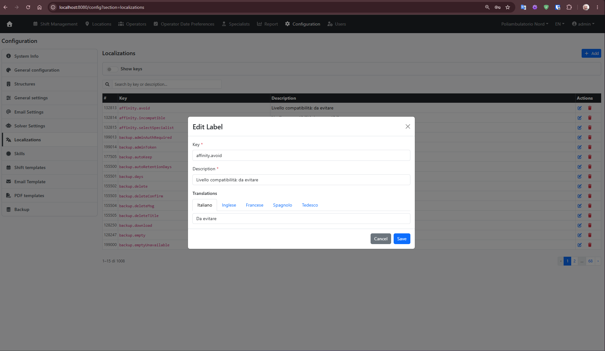

<em>Figure 20 — The localisation editor manages portable interface text in five languages.</em>

## 9. Monitor and administer the system

**System Info** displays the active database, application versions and principal dependencies.
Use **Check for updates** as an advisory tool; review compatibility and release notes before
changing production components.

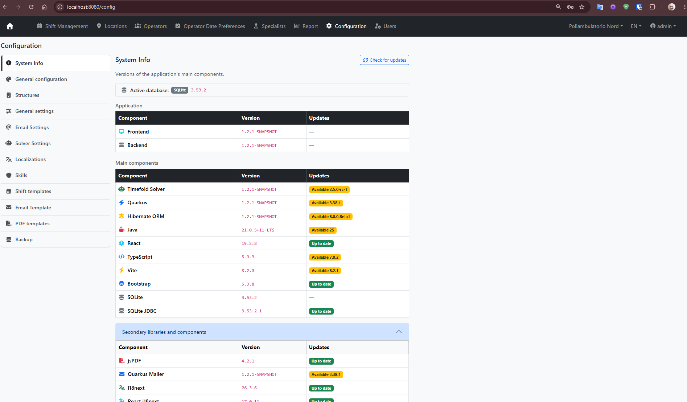

<em>Figure 21 — System information provides a concise operational and dependency inventory.</em>

Administrators manage application accounts from **Users**. Review the assigned role and active
status before granting access. Accounts are never deleted, only deactivated: the row and its
last-login record are kept for auditing, and the interface offers no delete control.

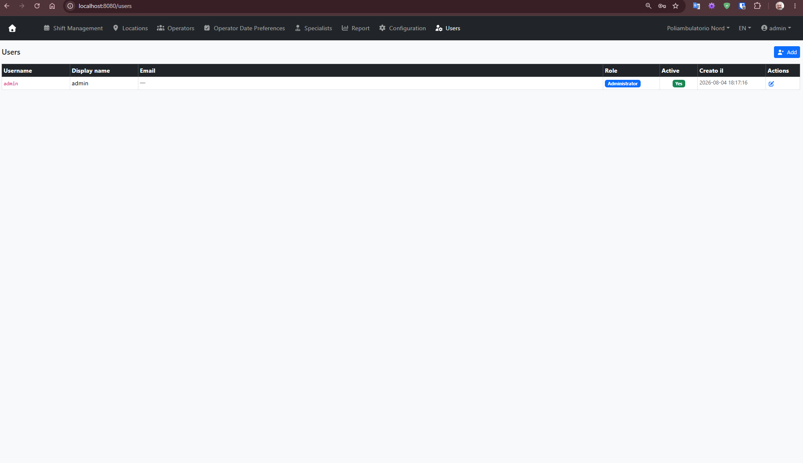

<em>Figure 22 — User administration controls roles, approval and access to protected application functions.</em>

---

## Where to go next

| Question | Document |
|---|---|
| How do roles and registration work? | [`AUTHENTICATION.md`](AUTHENTICATION.md) |
| Why does the solver behave like this? | [`ARCHITECTURE.md`](ARCHITECTURE.md) |
| How do I back up, restore or move an installation? | [`CONFIGURATION.md`](CONFIGURATION.md) |
